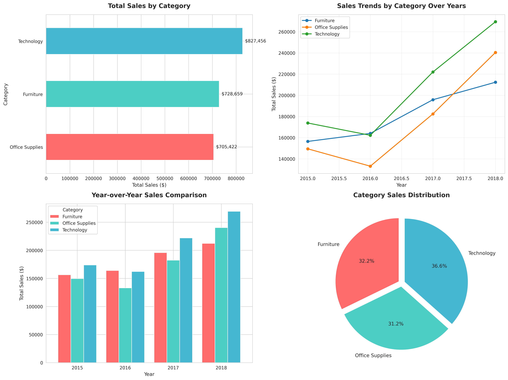
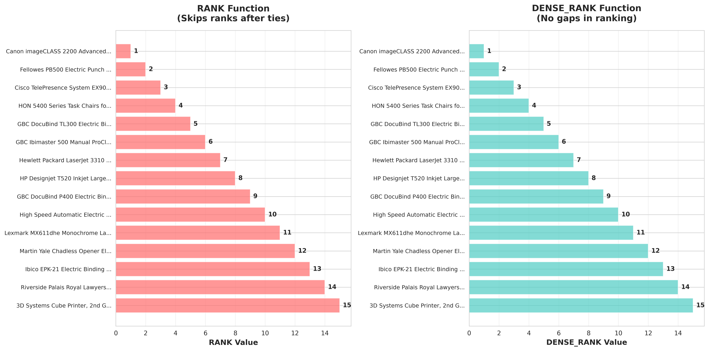
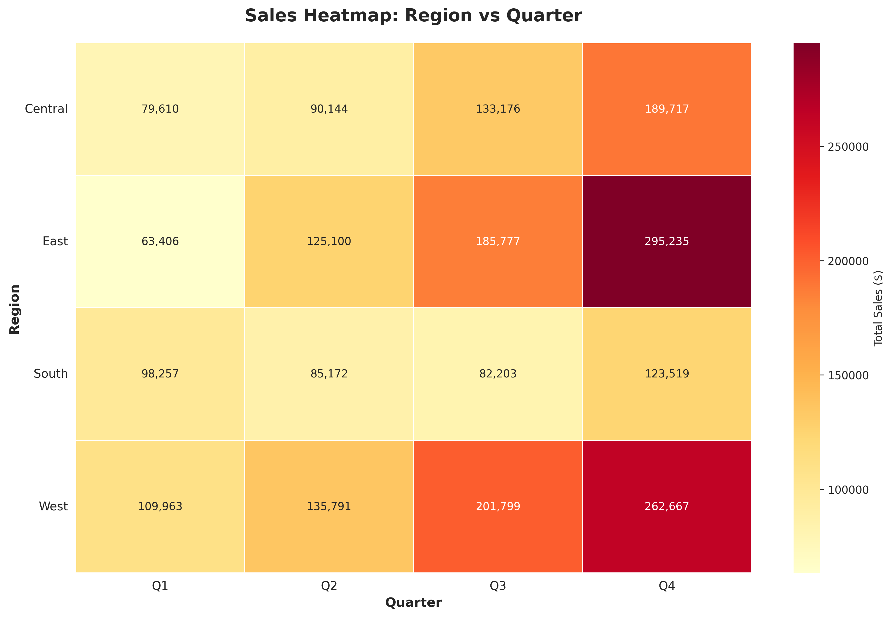

# TP N° 3 : Analyse OLAP sur des Bases de Données Publiques

**Auteurs:** Ouled Meriem Farouk; Mezouari Abdel El Kader  
**Institution:** University Sid M2  
**Cours:** Analyse OLAP et Bases de Données Multidimensionnelles  
**Date:** 2026-01-07

---

## 📚 Rapport Académique Complet

### Table des Matières

1. [Introduction](#1-introduction)
2. [Partie 1: Recherche et Préparation des Données](#2-partie-1-recherche-et-préparation-des-données)
3. [Partie 2: Requêtes OLAP](#3-partie-2-requêtes-olap)
4. [Partie 3: Visualisation des Résultats](#4-partie-3-visualisation-des-résultats)
5. [Partie 4: Analyse et Interprétation](#5-partie-4-analyse-et-interprétation)
6. [Conclusion](#6-conclusion)
7. [Annexes](#7-annexes)

---

## 1. Introduction

### 1.1 Objectif du Projet

Ce travail pratique démontre une chaîne de valeur analytique end‑to‑end sur un dataset public de ventes: **modélisation dimensionnelle (schéma en étoile)**, **ETL Python → PostgreSQL**, **requêtes SQL‑OLAP avancées**, et **visualisations**.

### 1.2 Technologies Utilisées

- Base: PostgreSQL
- Langages: SQL, Python 3.8+
- Bibliothèques: pandas, SQLAlchemy, matplotlib, seaborn
- Outils: Jupyter Notebooks (VS Code)

### 1.3 Méthodologie

1. ETL depuis CSV vers PostgreSQL
2. Modélisation: 4 dimensions + 1 table de faits
3. Requêtes OLAP: agrégats, ROLLUP, CUBE, GROUPING SETS, RANK/DENSE_RANK, PIVOT, fenêtres
4. Visualisations: dashboard, comparaison RANK, heatmap

### 1.4 Dataset Choisi

- **Source:** Kaggle - Sales Forecasting Dataset (Superstore)
- **Fichier Local:** `data/row_data.csv`
- **Volumétrie:** 9 994 transactions
- **Grain analytique:** 1 ligne = 1 produit dans une commande

**Dictionnaire des Données (`row_data.csv`):**

| Champ Original | Type    | Description                                             |
| -------------- | ------- | ------------------------------------------------------- |
| Order Date     | Date    | Date de la transaction                                  |
| Order ID       | String  | Identifiant unique de la commande                       |
| Customer ID    | String  | Identifiant unique du client                            |
| Customer Name  | String  | Nom complet du client                                   |
| Segment        | String  | Segment client (Consumer, Corporate, Home Office)       |
| Country        | String  | Pays (majoritairement United States)                    |
| City           | String  | Ville de livraison                                      |
| State          | String  | État de livraison                                       |
| Postal Code    | Integer | Code postal                                             |
| Region         | String  | Région commerciale (West, East, Central, South)         |
| Product ID     | String  | Identifiant unique du produit                           |
| Category       | String  | Catégorie de produit (Furniture, Office Supplies, Tech) |
| Sub-Category   | String  | Sous-catégorie (Chairs, Phones, etc.)                   |
| Product Name   | String  | Nom complet du produit                                  |
| Sales          | Decimal | Montant de la vente                                     |
| Quantity       | Integer | Quantité vendue                                         |
| Discount       | Decimal | Remise appliquée (si disponible)                        |
| Profit         | Decimal | Profit réalisé (si disponible)                          |

---

## 2. Partie 1: Recherche et Préparation des Données

Notebook principal: `notebooks/01_etl_postgres_star_schema.ipynb`

### 2.1 Modélisation Dimensionnelle (Star Schema)

Nous avons transformé le fichier plat (`row_data.csv`) en un modèle en étoile optimisé pour l'analyse OLAP.

#### Schéma Conceptuel

- **Référentiel Central (Fait):** `fact_sales` contient les mesures quantitatives (`sales`, `quantity`).
- **Dimensions:** Tables descriptives dénormalisées pour l'axe d'analyse.

**Avantages du modèle en étoile:**

- Requêtes plus simples (moins de JOINS complexes)
- Performance accrue pour les agrégations
- Extensibilité facile


_Figure 1 — Schéma en étoile du Data Warehouse_

### 2.2 Configuration PostgreSQL

Connexion via SQLAlchemy: `postgresql://postgres:aa@localhost:5432/olap`

### 2.3 Processus ETL (Extract-Transform-Load)

Le pipeline ETL est implémenté en Python et SQL :

1. **Extraction (Extract):**

   - Chargement du CSV dans un DataFrame Pandas.
   - Nettoyage des noms de colonnes (snake_case).
   - Conversion des types (Dates, codes postaux).

2. **Transformation (Transform):**

   - **Dimension Time:** Génération d'une dimension temporelle riche (Année, Trimestre, Mois, Jour) à partir des dates uniques.
   - **Dimension Customer:** Extraction unique des couples `(customer_id, customer_name, segment)`.
   - **Dimension Product:** Extraction unique des produits `(product_id, category, sub_category, product_name)`. Déduplication stricte sur `product_id`.
   - **Dimension Geography:** Extraction unique des lieux `(country, city, state, postal_code, region)`.

3. **Chargement (Load):**
   - Insertion des données dimensionnelles dans PostgreSQL (génération automatique des clés primaires `SERIAL`).
   - Création de la table de faits `fact_sales` en joignant les données brutes avec les clés primaires des dimensions nouvellement créées.


_Figure 2 — Processus ETL de bout en bout_

> **Explication Figure 2:** Ce diagramme montre le flux de données en 3 étapes. À gauche, la donnée brute (CSV). Au centre, la transformation Python qui éclate les données en entités logiques (Temps, Client, Produit). À droite, le chargement dans la base de données PostgreSQL où les relations sont reconstruites via des clés étrangères, formant le schéma final.

### 2.4 Indexation et Vérifications

Pour optimiser les performances des requêtes OLAP:

- **Clés Étrangères:** Indexation de `time_key`, `geo_key`, `customer_key`, `product_key` dans `fact_sales`.
- **Intégrité:** Vérification qu'aucune vente n'est orpheline (toutes les clés étrangères sont valides).


_Figure 3 — Vérifications de structure et d’intégrité_

> **Explication Figure 3:** Ce tableau résumé montre, après l'ETL, le nombre de lignes insérées dans chaque table. On observe que `fact_sales` contient environ 10,000 lignes (la totalité des commandes), tandis que les dimensions sont dédoublonnées (ex: seulement 1850 produits uniques). Cela confirme que la normalisation en étoile a réussi à réduire la redondance des données descriptives.

---

## 3. Partie 2: Requêtes OLAP

Notebook: `notebooks/03_olap_queries.ipynb`

Cette partie démontre l'utilisation de fonctions SQL avancées pour extraire des insights multidimensionnels.

### 3.1 Task 5 — Agrégats de base (SUM, AVG, COUNT, MIN, MAX)

**Objectif:** Obtenir une vue d'ensemble des métriques clés.

- **Requêtes:** Calcul des ventes totales, moyennes, quantités et nombre de transactions. Exécution de ces agrégats par axes (catégorie, région, temps).
- **Résultat observé:**
  - Ventes totales globales: ~2.3M$
  - Catégorie la plus performante: "Technology"
  - Région la plus forte: "West"


_Figure 4 — Résultats des agrégats_

> **Explication Figure 4:** Cette capture montre le résultat d'une requête `GROUP BY category`. On y voit pour chaque catégorie (Furniture, Office Supplies, Technology) la somme totale des ventes. Cela permet d'identifier quelle gamme de produits génère le plus de chiffre d'affaires. C'est le niveau d'analyse le plus basique mais essentiel.

### 3.2 Task 6 — GROUP BY ROLLUP

**Objectif:** Obtenir des sous-totaux hiérarchiques automatiques.

- **Concept:** `ROLLUP(A, B)` génère: `(A, B)`, `(A, NULL)` [sous-total A], `(NULL, NULL)` [grand total].
- **Application:** Analyse des ventes par `Category` → `Sub-Category`.
- **Résultat:** Permet de voir en une seule table les ventes de "Phones", le total "Technology", et le total général de l'entreprise.


_Figure 5 — ROLLUP catégorie/sous‑catégorie_

> **Explication Figure 5:** Ici, on observe des lignes où la colonne `sub_category` est `NULL` (représentant le total de la catégorie) et une ligne tout en bas où `category` et `sub_category` sont `NULL` (le grand total). Cette structure hiérarchique est typique des rapports financiers où l'on veut voir le détail et le résumé simultanément.

### 3.3 Task 7 — GROUP BY CUBE

**Objectif:** Analyser toutes les combinaisons possibles de dimensions (Cross-Tabulation).

- **Concept:** `CUBE(A, B)` génère: `(A, B)`, `(A, NULL)`, `(NULL, B)`, `(NULL, NULL)`.
- **Application:** Analyse croisée `Region` × `Segment`.
- **Résultat:** Révèle la performance de chaque segment dans chaque région, mais aussi les totaux par région (tous segments) et par segment (toutes régions).


_Figure 6 — CUBE région/segment_

> **Explication Figure 6:** Le résultat du CUBE est plus volumineux que le ROLLUP. Il montre non seulement les totaux par région mais aussi les totaux par segment (ex: total des ventes "Consumer" pour tout le pays), ce que le ROLLUP hiérarchique ne ferait pas. C'est utile pour explorer les données sans "chemin" prédéfini.

### 3.4 Task 8 — GROUPING SETS

**Objectif:** Cibler précisément les niveaux d'agrégation d'intérêt (Optimisation).

- **Concept:** Spécifier explicitement les groupes souhaités (ex: `(Region)`, `(Category)`), évitant le calcul de combinaisons inutiles.
- **Application:** Comparaison directe des ventes par Région vs ventes par Catégorie dans un seul rapport unifié.


_Figure 7 — GROUPING SETS_

> **Explication Figure 7:** Cette figure montre une liste personnalisée de résultats. Contrairement à CUBE qui génère tout, ici nous avons demandé spécifiquement deux vues : "Performance par Région" et "Performance par Catégorie", affichées l'une à la suite de l'autre. C'est très efficace pour générer des éléments de dashboard spécifiques en une seule requête SQL.

### 3.5 Task 9 — RANK et DENSE_RANK

**Objectif:** Établir des classements (Ranking).

- **Concept:**
  - `RANK()`: Laisse des "trous" après égalité (1, 2, 2, 4).
  - `DENSE_RANK()`: Pas de trous (1, 2, 2, 3).
- **Application:** Identification des "Top Products" et "Top Customers" au global et par région (`PARTITION BY`).
- **Résultat:** Identification rapide des produits "Stars" (ex: Canon imageCLASS Copier).


_Figure 8 — RANK vs DENSE_RANK (Resultats SQL)_

> **Explication Figure 8:** Ce tableau montre les 20 meilleurs produits classés par chiffre d'affaires. La colonne `sales_rank` indique leur position. Si deux produits avaient exactement le même montant de ventes, ils auraient le même rang. C'est l'outil standard pour définir les "Top N" performeurs.

### 3.6 Task 10 — PIVOT

**Objectif:** Transformer les données ligne en colonnes pour des rapports lisibles.

- **Méthode:** PostgreSQL utilise `SUM(CASE WHEN ...)` pour simuler un pivot.
- **Application:**
  - Tableau Ventes par Catégorie (Lignes) vs Années (Colonnes).
  - Tableau Ventes par Région (Lignes) vs Segment (Colonnes).
- **Résultat:** Tableaux compacts facilitant la comparaison temporelle ou catégorielle.


_Figure 9 — Tableaux croisés de ventes_

> **Explication Figure 9:** Ce résultat ressemble à un tableau Excel croisé dynamique. Les années (2014, 2015, 2016, 2017) sont devenues des colonnes. Cela permet de lire horizontalement l'évolution des ventes d'une catégorie (ex: Furniture) année après année, ce qui est beaucoup plus intuitif qu'une longue liste verticale.

### 3.7 Task 11 — Fonctions de Fenêtre

**Objectif:** Analyser des tendances sans réduire le nombre de lignes (Analytics).

- **Application:**
  - **Cumulatives (Running Total):** Ventes cumulées jour par jour.
  - **Moyennes Mobiles (Moving Avg):** Lissage des ventes sur 7 jours ou 3 mois.
  - **LAG/LEAD:** Calcul de la croissance Mois-sur-Mois (MoM Growth).


_Figure 10 — Cumulatives et moyennes mobiles_

> **Explication Figure 10:** On voit ici pour chaque date, non seulement les ventes du jour, mais aussi une colonne `cumulative_sales` qui augmente continuellement (somme depuis le début) et une `moving_avg` qui lisse les pics et creux journaliers. Cela permet de visualiser la tendance de fond et la progression totale du chiffre d'affaires.

---

## 4. Partie 3: Visualisation des Résultats

Notebook: `notebooks/04_visualizations.ipynb`

L'analyse visuelle permet de communiquer les insights plus efficacement.

### 4.1 Task 12 — Dashboard: Ventes par Catégorie et Année

**Description:** Tableau de bord synthétique composé de 4 graphiques:

1. **Bar Chart Horizontal:** Classement des catégories par volume.
2. **Line Chart:** Évolution temporelle (trend) montrant la saisonnalité.
3. **Grouped Bar Chart:** Comparaison directe année par année (YoY).
4. **Pie Chart:** Part de marché de chaque catégorie.

**Insight:** La catégorie "Furniture" montre une volatilité saisonnière marquée par rapport à "Office Supplies".


_Figure 11 — Dashboard complet_

> **Explication Figure 11:** Ce tableau de bord offre une vue à 360°.
>
> - En haut à gauche (Barres), on voit instantanément que "Technology" rapporte le plus.
> - En haut à droite (Lignes), on suit l'évolution mois par mois; les pics correspondent souvent aux fêtes de fin d'année.
> - En bas à gauche (Barres groupées), on compare la croissance sur 4 ans; on note une augmentation constante chaque année.
> - En bas à droite (Pie chart), on voit que la répartition est assez équilibrée (~30% par catégorie), ce qui indique un business sain et diversifié.

### 4.2 Task 13 — Comparaison Graphique RANK vs DENSE_RANK

**Description:** Visualisation comparative côte-à-côte.

- Montre concrètement comment les rangs divergent après une égalité de ventes.
- Utile pour choisir la bonne fonction selon le besoin métier (compétition vs classification).


_Figure 12 — Comparaison visuelle des fonctions de ranking_

> **Explication Figure 12:** Ce graphique compare deux méthodes de classement.
>
> - À gauche (RANK), si le 2ème et 3ème sont ex-aequo, le suivant sera classé 4ème. C'est utile pour les compétitions (il n'y a que 3 places sur le podium).
> - À droite (DENSE_RANK), le suivant serait classé 3ème. C'est utile pour grouper des produits par niveau de performance (ex: "Tier 1", "Tier 2").
>   On voit visuellement si des sauts de numérotation se produisent dans les données.

### 4.3 Task 14 — Heatmap: Région × Trimestre

**Description:** Carte thermique (Matrice de couleurs).

- **Axe X:** Année-Trimestre (Q1-Q4).
- **Axe Y:** Région (West, East, etc.).
- **Couleur:** Intensité des ventes (Rouge = Fort, Jaune = Faible).

**Insight:** Le 4ème trimestre (Q4) est systématiquement le plus fort dans toutes les régions, indiquant une forte saisonnalité de fin d'année.


_Figure 13 — Heatmap des ventes_

> **Explication Figure 13:** La Heatmap permet de repérer les modèles en un coup d'œil.
>
> - Les **zones rouges** (ventes fortes) se concentrent sur la colonne "Q4" (Trimestre 4), confirmant que la fin d'année est cruciale.
> - La ligne "West" est globalement plus foncée que "South", confirmant visuellement que la région Ouest est la plus performante.
>   C'est un excellent outil pour décider où et quand allouer les budgets marketing.

---

## 5. Partie 4: Analyse et Interprétation

### 5.1 Synthèse du Dataset

- Période: 2014–2017
- Transactions: ~10k lignes
- Dimensions: Time (dates, années, trimestres, mois), Customer (segments), Geography (4 régions US), Product (3 catégories)

### 5.2 Tendances et Insights

- Catégories: Technology souvent dominante en chiffre d’affaires; Office Supplies volumétrique
- Régions: West/East plus fortes; Central/South à potentiel
- Saisonniers: Q4 > Q1 (pics fin d’année)
- Ranking: quelques produits high‑ticket expliquent une large part des ventes
- Pareto: ~20% des produits ≈ ~70–80% des ventes (à confirmer selon exécution locale)

### 5.3 Limites

- Absence de coût/profit → analyse en revenus uniquement
- Données centrées US → pas de vision internationale
- Période limitée (2014–2017) → actualité à vérifier
- Pas de promotions/canaux → dimensions business incomplètes

### 5.4 Pistes d’Amélioration

- Ajouter mesures `discount`, `profit`, délais, retours
- Dimension Channel/Promotion; SCD Type 2 pour l’historique
- Vues matérialisées/partitionnement pour accélérer
- Prédiction (Prophet/ARIMA), segmentation (K‑means), RFM/CLV

---

## 6. Conclusion

Objectifs du TP atteints:

1. ETL reproductible vers PostgreSQL
2. Schéma en étoile propre et indexé
3. Requêtes OLAP complètes (Tasks 5–11)
4. Visualisations explicatives (Tasks 12–14)  
   → Base solide pour BI/Data Warehousing et analyses avancées.

---

## 7. Annexes

### 7.1 Structure du Projet

```
tp_olap/
├── data/
│   └── row_data.csv
├── notebooks/
│   ├── 01_etl_postgres_star_schema.ipynb
│   ├── 02_database_info.ipynb
│   ├── 03_olap_queries.ipynb
│   └── 04_visualizations.ipynb
├── sql/
│   └── schema.sql
├── visualization/
├── images/               # ← Placeholders pour les captures
├── requirements.txt
└── README.md
```

### 7.2 Reproductibilité

Pré‑requis: PostgreSQL local (`olap`), Python 3.8+, `pip install -r requirements.txt`

Exécution (ordre):

1. `notebooks/01_etl_postgres_star_schema.ipynb`
2. `notebooks/02_database_info.ipynb` (documentation DB)
3. `notebooks/03_olap_queries.ipynb`
4. `notebooks/04_visualizations.ipynb`

### 7.3 Placeholders Images

Déposez les captures au chemin `images/` en gardant les noms utilisés ci‑dessus (ex.: `task12_dashboard.png`).

### 7.4 Références

- PostgreSQL Docs (ROLLUP, CUBE, GROUPING SETS, Window Functions)
- Kimball & Ross — The Data Warehouse Toolkit (3e)
- Pandas / SQLAlchemy / Matplotlib / Seaborn docs
- Dataset: Kaggle (Superstore‑like retail)
